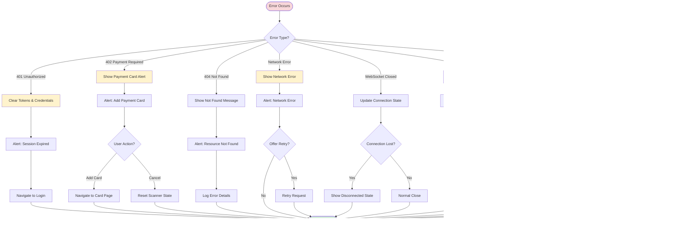

# Flow Diagrams - SuperApp Charging System

## 1. Overall System Architecture


---

## 2. Complete Charging Flow (Start to Finish)


---

## 3. WebSocket Connection Flow (User → Gateway → Charge Point)


---

## 4. OCPP Message Processing Flow


---

## 5. Transaction Lifecycle State Machine


---

## 6. Error Handling Flow



---

## 7. Data Flow - Real-time Charging Updates


---

## 8. Payment Card Check Flow


---

## 9. Gateway Session Management


---

## 10. Summary Screen Navigation Flow

```mermaid
flowchart TD
    Start([Charging Stopped]) --> CheckEvent{Stop Event<br/>Received?}
    
    CheckEvent -->|Yes| CheckStatus{Connector<br/>Status?}
    CheckEvent -->|No| Wait[Wait for Event]
    Wait --> CheckEvent
    
    CheckStatus -->|Finishing| FetchSummary
    CheckStatus -->|SuspendedEV| FetchSummary
    CheckStatus -->|SuspendedEVSE| FetchSummary
    CheckStatus -->|Available| FetchSummary
    CheckStatus -->|Other| Wait
    
    FetchSummary[Fetch Transaction Summary] --> APICall[GET /transactions/{id}/summary]
    APICall --> CheckResponse{Response OK?}
    
    CheckResponse -->|Yes| ParseData[Parse Summary Data]
    CheckResponse -->|No| ShowError[Show Error Message]
    
    ParseData --> PrepareParams[Prepare Navigation Params:<br/>- transactionId<br/>- energy<br/>- cost<br/>- duration<br/>- startTime<br/>- endTime<br/>- meterStart<br/>- meterStop<br/>- rate]
    
    PrepareParams --> Navigate[router.replace('/charge-session/summary')]
    Navigate --> DisplaySummary[Display Summary Screen]
    
    DisplaySummary --> ShowData[Show:<br/>- Energy Delivered<br/>- Total Cost<br/>- Duration<br/>- Start/End Time<br/>- Rate Applied]
    
    ShowData --> UserAction{User Action?}
    UserAction -->|Back to Home| NavigateHome[Navigate Home]
    UserAction -->|View History| NavigateHistory[Navigate to History]
    UserAction -->|Stay| ShowData
    
    NavigateHome --> End([Flow Complete])
    NavigateHistory --> End
    ShowError --> End
    
    style Start fill:#f8d7da
    style FetchSummary fill:#fff3cd
    style DisplaySummary fill:#e1f5ff
    style End fill:#d4edda
```

---

## Legend


- **Blue**: Mobile App Components
- **Yellow**: WebSocket Gateway Components
- **Green**: Backend API Components
- **Red**: Charging Station / Charge Point Components
