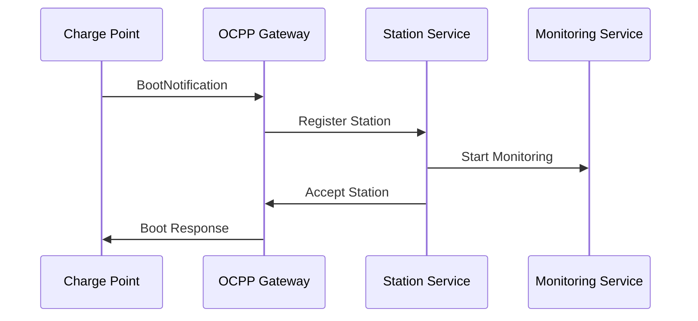
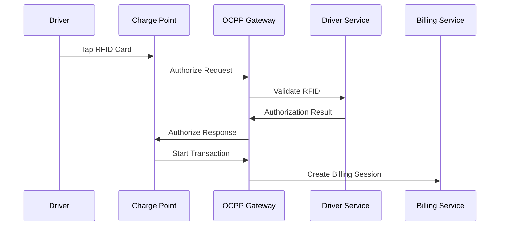
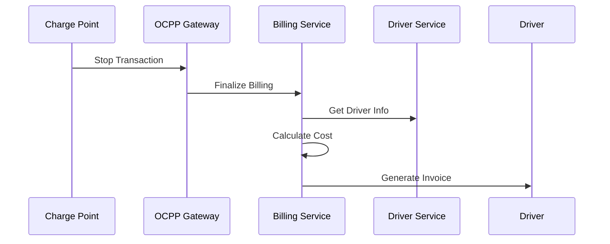

# 🚗⚡ CSMS Core Architecture

## 📋 Part 1: CSMS Core Microservices Architecture

### 🏗️ CSMS Core Services (Charging Station Management System)

| Service | Port | Database | Responsibility | CSMS Function |
|---------|------|----------|----------------|----------------|
| 🚗️ **Station Management** | 3001 | `csms_stations` | Station registration • Configuration • Location management | Station Management |
| 👨‍💼 **Driver Management** | 3002 | `csms_drivers` | Driver profiles • RFID tags • Membership • Authentication | Driver Management |
| 💰 **Billing Service** | 3003 | `csms_billing` | Pricing • Tariffs • Invoices • Payment processing | Billing & Payment |
| 📊 **Monitoring Service** | 3004 | `csms_monitoring` | Real-time monitoring • Alerts • Analytics • Reporting | Monitoring & Analytics |
| 🚪 **API Gateway** | 3000 | - | Request routing • Service discovery • Authentication | API Gateway |

### 🗂️ CSMS Data Flow Architecture

```
🚗️ Charging Station Hardware
        ↓ (OCPP/WebSocket)
🚗️ Station Management Service
        ↓ (Internal Events)
📊 Monitoring Service ←→ 💰 Billing Service
        ↓                     ↓
👨‍💼 Driver Management ←→ 🚪 API Gateway
        ↓                     ↓
      📱 Mobile App          🌐 Web Dashboard
```

### 🎯 CSMS Core Function Modules

#### 1. 🚗️ Station Management Service (Station Service)
- **Station Registration & Management**
  - Station information entry
  - Configuration management
  - Location coordinates management
  - Status monitoring

#### 2. 👨‍💼 Driver Management Service (Driver Service)
- **Driver Management**
  - User profiles
  - RFID card management
  - Membership levels
  - Access permissions

#### 3. 💰 Billing Service (Billing Service)
- **Billing System**
  - Price management
  - Billing rules
  - Invoice generation
  - Payment processing

#### 4. 📊 Monitoring Service (Monitoring Service)
- **Monitoring & Analytics**
  - Real-time monitoring
  - Alert system
  - Data analysis
  - Report generation

---

## 🔌 Part 2: OCPP Protocol Layer

### OCPP Communication Architecture

```
🚗️ Charge Point (Hardware)
        ↓ (WebSocket)
🚗️ OCPP Gateway (Protocol Handler)
        ↓ (Protocol Adaptation)
├─► OCPP 1.6 Protocol
├─► OCPP 2.0.1 Protocol
└─► OCPP 2.1 Protocol
        ↓
🚗️ Station Management Service
```

### OCPP Message Processing

| OCPP Message | Processing Service | CSMS Function |
|---------------|-------------------|----------------|
| BootNotification | Station Service | Station registration |
| Authorize | Driver Service | RFID validation |
| StartTransaction | Station + Billing | Start charging billing |
| StopTransaction | Station + Billing | End charging settlement |
| MeterValues | Monitoring Service | Real-time energy monitoring |
| StatusNotification | Monitoring Service | Device status updates |

---

## 🔗 Part 3: Integration & Data Flow

### CSMS Core Business Processes

#### 1. 🚗️ Station Registration Process


#### 2. 👨‍💼 Driver Charging Process


#### 3. 💰 Billing & Settlement Process


### CSMS Database Design

#### 🚗️ Stations Database
```sql
-- Stations table
CREATE TABLE stations (
    id VARCHAR(255) PRIMARY KEY,
    station_id VARCHAR(255) UNIQUE NOT NULL,
    name VARCHAR(255) NOT NULL,
    operator_id VARCHAR(255),
    location_lat DECIMAL(10, 8),
    location_lng DECIMAL(11, 8),
    address JSONB,
    status VARCHAR(50) DEFAULT 'ACTIVE',
    ocpp_version VARCHAR(10) DEFAULT '1.6',
    created_at TIMESTAMP DEFAULT CURRENT_TIMESTAMP
);

-- Connectors table
CREATE TABLE connectors (
    id VARCHAR(255) PRIMARY KEY,
    station_id VARCHAR(255) NOT NULL,
    connector_id INTEGER NOT NULL,
    type VARCHAR(50) DEFAULT 'TYPE_2',
    power_rating INTEGER DEFAULT 22000,
    status VARCHAR(50) DEFAULT 'AVAILABLE',
    FOREIGN KEY (station_id) REFERENCES stations(id)
);
```

#### 👨‍💼 Drivers Database
```sql
-- Drivers table
CREATE TABLE drivers (
    id VARCHAR(255) PRIMARY KEY,
    user_id VARCHAR(255) UNIQUE NOT NULL,
    name VARCHAR(255) NOT NULL,
    email VARCHAR(255) UNIQUE NOT NULL,
    phone VARCHAR(20),
    membership_level VARCHAR(50) DEFAULT 'BASIC',
    status VARCHAR(50) DEFAULT 'ACTIVE',
    created_at TIMESTAMP DEFAULT CURRENT_TIMESTAMP
);

-- RFID cards table
CREATE TABLE rfid_cards (
    id VARCHAR(255) PRIMARY KEY,
    card_id VARCHAR(255) UNIQUE NOT NULL,
    driver_id VARCHAR(255) NOT NULL,
    status VARCHAR(50) DEFAULT 'ACTIVE',
    expires_at TIMESTAMP,
    created_at TIMESTAMP DEFAULT CURRENT_TIMESTAMP,
    FOREIGN KEY (driver_id) REFERENCES drivers(id)
);
```

#### 💰 Billing Database
```sql
-- Charging sessions table
CREATE TABLE charging_sessions (
    id VARCHAR(255) PRIMARY KEY,
    session_id VARCHAR(255) UNIQUE NOT NULL,
    station_id VARCHAR(255) NOT NULL,
    connector_id INTEGER NOT NULL,
    driver_id VARCHAR(255) NOT NULL,
    rfid_card_id VARCHAR(255),
    start_time TIMESTAMP NOT NULL,
    end_time TIMESTAMP,
    start_meter INTEGER NOT NULL,
    end_meter INTEGER,
    energy_consumed DECIMAL(10, 3),
    cost DECIMAL(10, 2),
    status VARCHAR(50) DEFAULT 'ACTIVE',
    created_at TIMESTAMP DEFAULT CURRENT_TIMESTAMP,
    FOREIGN KEY (station_id) REFERENCES stations(id),
    FOREIGN KEY (driver_id) REFERENCES drivers(id)
);

-- Invoices table
CREATE TABLE invoices (
    id VARCHAR(255) PRIMARY KEY,
    invoice_number VARCHAR(255) UNIQUE NOT NULL,
    driver_id VARCHAR(255) NOT NULL,
    session_ids JSONB,
    total_amount DECIMAL(10, 2) NOT NULL,
    status VARCHAR(50) DEFAULT 'PENDING',
    created_at TIMESTAMP DEFAULT CURRENT_TIMESTAMP,
    paid_at TIMESTAMP,
    FOREIGN KEY (driver_id) REFERENCES drivers(id)
);
```

---

## 🚀 Service Port Mapping (Final Architecture)

| Port | Service | Type | Database | CSMS Function |
|------|---------|------|----------|----------------|
| 3000 | API Gateway | REST/WS | - | API Gateway • Authentication |
| 3001 | Station Management | REST | `csms_stations` | Station Management • Configuration |
| 3002 | Driver Management | REST | `csms_drivers` | Driver Management • RFID |
| 3003 | Billing Service | REST | `csms_billing` | Billing • Settlement |
| 3004 | Monitoring Service | REST/WS | `csms_monitoring` | Real-time Monitoring • Alerts |
| 4000 | OCPP Gateway | WebSocket | - | OCPP Protocol Processing |
| 4001 | Charge Point Service | REST | `csms_charge_points` | Charge Point Management |
| 5432 | PostgreSQL | Database | SQL | All CSMS Data |
| 6379 | Redis | Cache | In-memory | Sessions • Cache |
| 8500 | Consul | Service Discovery | HTTP | Service Registry |

---

## 🎯 CSMS Core Value Proposition

### 1. 🚗️ Complete Station Lifecycle Management
- End-to-end station lifecycle management
- Real-time configuration updates
- Geographic location management
- Status monitoring and alerts

### 2. 👨‍💼 Comprehensive Driver Management System
- Multi-tier membership management
- RFID card management system
- Usage permission control
- Mobile app integration ready

### 3. 💰 Flexible Billing System
- Multiple billing models
- Real-time billing calculations
- Automated settlement processing
- Multiple payment method support

### 4. 📊 Intelligent Monitoring & Analytics
- Real-time device monitoring
- Predictive maintenance alerts
- Data analytics and reporting
- Business intelligence dashboard

---

## 🔧 Clean Architecture Achieved

### ✅ Removed Old Monolithic Files
- ❌ `src/` directory (old monolithic structure)
- ❌ `prisma/` directory (old database schema)
- ❌ `node_modules/` (root dependencies)
- ❌ `Dockerfile` (old container setup)
- ❌ Old `package.json` configurations

### ✅ Pure Microservices Architecture
- 🚀 Each service has its own dependencies
- 🚀 Each service has its own database
- 🚀 Independent deployment and scaling
- 🚀 Clean separation of concerns
- 🚀 Professional CSMS domain focus

---

*This architecture ensures complete CSMS system professionalism and scalability!* 🎯